# Manufacturing Business Intelligence (BI) System
## System Architecture & Specification Document

---

## 1. Abstract
The **Manufacturing Business Intelligence (BI) System** is an enterprise-grade web application engineered to centralize, analyze, and optimize industrial manufacturing workflows. Built on a high-performance **Next.js 14 (App Router)** frontend and powered by a robust backend using an **Oracle SQL Database** via Next.js serverless API routes, the platform delivers unified visibility into real-time production runs, inventory capacities, sales pipeline tracking, raw material utilization, employee productivity, and supplier performance. By bridging raw factory-floor metrics with executive decision-making tools, the system empowers operational managers to minimize downtime, prevent inventory bottlenecks, and maximize overall manufacturing efficiency.

---

## 2. Problem Statement
Modern manufacturing plants generate massive volumes of siloed data across disjointed operational units—production machinery, warehouse inventory shelves, supply chain logistics, and sales order desks. 
1. **Lack of Real-Time Visibility:** Factory floor managers and executives struggle to track ongoing production runs, machine utilization, and defect rates in real-time.
2. **Supply Chain Bottlenecks:** Unpredictable raw material lead times and unmonitored supplier delivery metrics frequently halt production lines due to unexpected stockouts.
3. **Inefficient Inventory Management:** Warehouses lack automated reorder alerts, resulting in either costly overstocking or sudden critical shortages.
4. **Disjointed Analytics:** Correlating employee shift efficiency with specific production output and financial profitability requires manual data aggregation across multiple incompatible legacy tools.

---

## 3. Gap Analysis

| Existing System Issues | Proposed Manufacturing BI Solution |
| :--- | :--- |
| Manual production tracking | Real-time production monitoring |
| Manual inventory management | Live inventory tracking |
| No centralized dashboard | Unified BI dashboard |
| Delayed reporting systems | Instant analytics & KPI updates |
| Weak security mechanisms | Firebase authentication & RBAC |
| No real-time alerts | Smart notification system |
| Separate department systems | Integrated cloud platform |
| Limited scalability | Scalable Firebase architecture |
| No employee performance tracking | Employee analytics dashboard |
| No supplier analytics | Supplier performance monitoring |
| Lack of cloud accessibility | Cloud-based dashboard |
| Limited data visualization | Interactive charts & analytics |
| No predictive insights | KPI & analytical intelligence |
| Slow order tracking | Real-time order status tracking |
| Traditional desktop systems | Responsive modern UI dashboard |

---

## 4. Entity-Relationship (ER) Diagram

The system operates on an interconnected relational schema across 10 core tables:

```mermaid
erDiagram
    EMPLOYEES ||--o{ PRODUCTION : manages
    EMPLOYEES ||--o{ WAREHOUSES : supervises
    WAREHOUSES ||--o{ INVENTORY : stores
    PRODUCTS ||--o{ INVENTORY : has_stock
    PRODUCTS ||--o{ ORDER_ITEMS : included_in
    PRODUCTS ||--o{ PRODUCTION : produced_via
    CUSTOMERS ||--o{ ORDERS : places
    ORDERS ||--|{ ORDER_ITEMS : contains
    SUPPLIERS ||--o{ RAW_MATERIALS : supplies
    RAW_MATERIALS ||--o{ MATERIAL_USAGE : consumed_in
    PRODUCTION ||--o{ MATERIAL_USAGE : records

    EMPLOYEES {
        NUMBER employee_id PK
        VARCHAR2 name
        VARCHAR2 department
        VARCHAR2 role
        VARCHAR2 shift
        DATE hire_date
        NUMBER salary
        VARCHAR2 status
    }
    PRODUCTS {
        NUMBER product_id PK
        VARCHAR2 product_name
        VARCHAR2 category
        NUMBER unit_price
        NUMBER cost_price
        VARCHAR2 unit
    }
    SUPPLIERS {
        NUMBER supplier_id PK
        VARCHAR2 supplier_name
        VARCHAR2 contact_person
        VARCHAR2 email
        NUMBER rating
        NUMBER on_time_delivery
        VARCHAR2 status
    }
    WAREHOUSES {
        NUMBER warehouse_id PK
        VARCHAR2 warehouse_name
        VARCHAR2 location
        NUMBER capacity
        VARCHAR2 manager
    }
    INVENTORY {
        NUMBER inventory_id PK
        NUMBER product_id FK
        NUMBER warehouse_id FK
        NUMBER quantity
        NUMBER reorder_level
        DATE last_updated
    }
    CUSTOMERS {
        NUMBER customer_id PK
        VARCHAR2 customer_name
        VARCHAR2 company
        VARCHAR2 email
        VARCHAR2 city
        VARCHAR2 region
    }
    ORDERS {
        NUMBER order_id PK
        NUMBER customer_id FK
        DATE order_date
        DATE delivery_date
        VARCHAR2 status
        NUMBER total_amount
    }
    ORDER_ITEMS {
        NUMBER item_id PK
        NUMBER order_id FK
        NUMBER product_id FK
        NUMBER quantity
        NUMBER unit_price
        NUMBER discount
    }
    PRODUCTION {
        NUMBER production_id PK
        NUMBER product_id FK
        NUMBER employee_id FK
        NUMBER planned_qty
        NUMBER actual_qty
        DATE production_date
        VARCHAR2 status
        VARCHAR2 machine_id
        VARCHAR2 shift
    }
    RAW_MATERIALS {
        NUMBER material_id PK
        VARCHAR2 material_name
        NUMBER supplier_id FK
        NUMBER unit_cost
        NUMBER stock_qty
        NUMBER reorder_level
        VARCHAR2 unit
    }
    MATERIAL_USAGE {
        NUMBER usage_id PK
        NUMBER material_id FK
        NUMBER production_id FK
        NUMBER quantity_used
        DATE usage_date
        NUMBER waste_qty
    }
```



---

## 5. System Modules (7 Core Modules)

The application is structured into **7 distinct operational modules** corresponding to the primary dashboard views and underlying business domains:

### Module 1: Overview & Executive KPI Module
- **Purpose:** Centralized real-time summary of plant health.
- **Key Features:** Live metrics for Total Revenue, Gross Profit, Active Orders, and Overall Production Output. Real-time warning banners for critical inventory lows and production line bottlenecks.

### Module 2: Production Management Module
- **Purpose:** Factory floor scheduling and machine tracking.
- **Key Features:** Workstation utilization tracking (`M-001` through `M-004`), shift allocation (Morning/Afternoon/Night), efficiency tracking (Actual vs. Planned Output), and automated anomaly/delay flagging.

### Module 3: Inventory Control Module
- **Purpose:** Multi-warehouse stock tracking and capacity management.
- **Key Features:** Real-time quantity auditing across 4 physical depots (Main Warehouse, North Storage, West Hub, South Depot), automated stock-status color-coding (Normal / Warning / Critical), and reorder point monitoring.

### Module 4: Sales & Customer Order Module
- **Purpose:** Order lifecycle tracking from fulfillment to delivery.
- **Key Features:** Order status pipelines (`Pending` $\rightarrow$ `Processing` $\rightarrow$ `Shipped` $\rightarrow$ `Delivered`), regional revenue distribution mapping (North, South, West), and itemized gross profit calculations per order.

### Module 5: Supplier & Supply Chain Module
- **Purpose:** Vendor performance auditing and procurement analysis.
- **Key Features:** Supplier rating calculation based on on-time delivery percentages and product quality scores, active/inactive probation tracking, and raw material procurement history.

### Module 6: Employee Productivity Module
- **Purpose:** Workforce shift allocation and performance metrics.
- **Key Features:** Department-wise performance distribution (Production, Quality, Inventory, Sales, Maintenance), individual employee productivity rankings, shift timing logs, and status tracking (Active vs. On-leave).

### Module 7: Raw Materials & Consumption Module
- **Purpose:** Resource tracking and waste management.
- **Key Features:** Raw material stock level monitoring, production batch material usage tracking (`MATERIAL_USAGE` table), scrap/waste quantity logging, and unit cost financial analysis.

---

## 6. Middleware Architecture

The application utilizes a multi-layered middleware pattern inside the Next.js API routing structure to ensure clean separation of concerns, secure execution, and high database connection efficiency.

```
[ Client Request ] 
       │
       ▼
┌────────────────────────────────────────────────────────┐
│ 1. Security Middleware (Next.js Edge / Route Handlers) │
│    - CORS Verification & Origin Validation             │
│    - API Key / Session Token Authentication            │
│    - Role-Based Route Protection (RBAC)                │
└────────────────────────────────────────────────────────┘
       │ (Authorized)
       ▼
┌────────────────────────────────────────────────────────┐
│ 2. Validation Middleware (Zod / Schema Validation)     │
│    - Parameter Sanitization (SQL Injection Prevention) │
│    - Type Enforcement & Boundary Checking              │
└────────────────────────────────────────────────────────┘
       │ (Validated)
       ▼
┌────────────────────────────────────────────────────────┐
│ 3. Database Connection Pooling (lib/db.ts)             │
│    - Oracle Connection Pool Acquisition (oracledb)     │
│    - Transaction Management (Commit / Rollback)        │
└────────────────────────────────────────────────────────┘
       │
       ▼
[ Oracle SQL Database Execution ]
```

### Connection Pool Lifecycle (`lib/db.ts`)
The middleware layer maintains a persistent connection pool (`min: 2, max: 10`) to eliminate connection overhead during high-frequency API polling from client dashboard widgets.

---

## 7. Security & Role-Based Access Control (RBAC)

Security is enforced at three distinct layers: Network/API, Application Logic, and Data Persistence.

```
┌─────────────────────────────────────────────────────────────────────────┐
│                      ADMIN (Full Plant Control)                         │
│   [ All Dashboards ]  [ System Config ]  [ User Management ] [ Write ]  │
└─────────────────────────────────────────────────────────────────────────┘
        │                                             │
        ▼                                             ▼
┌──────────────────────────────┐       ┌──────────────────────────────────┐
│  MANAGER (Operational Lead)  │       │     EMPLOYEE (Shop Floor)        │
│ [ All Dashboards ] [ Reports]│       │ [ Assigned Production Runs Only] │
│ [ Restricted System Settings]│       │ [ Read-only Inventory / Specs  ] │
└──────────────────────────────┘       └──────────────────────────────────┘
```

### Security Measures:
1. **Parameterized SQL Queries:** All API queries strictly use Oracle parameter binding (`:paramName`) rather than string concatenation, neutralizing all potential SQL injection vectors.
2. **Environment Variable Isolation:** Database connection credentials (`ORACLE_USER`, `ORACLE_PASSWORD`, `ORACLE_CONNECTSTRING`) are strictly maintained in server-side encrypted environment variables (`.env.local`) and never exposed to client bundles.
3. **Role Enforcement:** Route middleware checks user session scopes before returning sensitive financial or employee data:
   - **Admin:** Complete read/write access across all tables.
   - **Manager:** Full read access across all 7 modules; write access restricted to operational records (Production runs, Inventory updates, Order status changes).
   - **Employee:** Restricted view; access limited exclusively to active shift workstation schedules and basic material lookup tables.

---

## 8. Input Validation & Data Integration

To ensure the integrity, security, and accuracy of the manufacturing pipeline, the system enforces rigorous input validation and seamless data integration across all modules.

### 8.1 Input Validation Framework

Data entering the system is sanitized and validated at three distinct layers to prevent corruption and injection attacks:

1. **Client-Side Validation (Frontend):**
   - **Form Controls:** Real-time feedback using HTML5 constraints and React state validation (e.g., preventing negative values for production quantities).
   - **Type Checking:** TypeScript interfaces strictly define the shape of payloads sent to the backend.

2. **Server-Side Validation (Backend API):**
   - **Schema Validation:** Incoming JSON payloads are validated against strict schemas (e.g., Zod or Joi) before processing.
   - **Sanitization:** All string inputs are sanitized to strip malicious HTML/JS tags (XSS prevention).
   - **SQL Injection Prevention:** All database queries utilize **parameterized binding** (`:param`). The backend never concatenates raw user input into SQL strings.

3. **Database Constraints (Oracle SQL):**
   - **Domain Constraints:** `CHECK` constraints ensure logical boundaries (e.g., enforcing that `quantity >= 0`).
   - **Referential Integrity:** Strict `FOREIGN KEY` definitions prevent orphaned records (e.g., cannot delete a supplier that is linked to active raw materials).
   - **Status Enums:** Constraints ensure workflow states strictly match expected values (e.g., `Pending`, `Shipped`, `Delivered`).

### 8.2 Data Integration & Workflow Automation

The system eliminates data silos by automatically integrating operations across different business modules:

- **Production ↔ Inventory Integration:** 
  When a Production Run is marked as `Completed`, the backend automatically deducts the required Raw Materials based on the `MATERIAL_USAGE` metrics and increments the finished product stock in the `INVENTORY` table via a single ACID-compliant database transaction.
  
- **Sales ↔ Inventory Integration:** 
  When a Sales Order transitions to `Shipped`, the allocated stock is automatically decremented from the designated warehouse, immediately triggering a real-time recalculation against the `reorder_level` threshold.

- **KPI Analytics Integration:**
  Financial data from `ORDERS` (revenue) and `ORDER_ITEMS` (profit margin calculation via `cost_price`) are continuously aggregated and integrated into the Executive KPI module, ensuring managers look at live financial health rather than end-of-month reports.

- **Cross-Platform Cloud Sync:**
  The architecture supports external data integration (e.g., connecting to Firebase or external ERPs) via REST API webhooks to broadcast live KPI updates, trigger push notifications for low-stock alerts, and synchronize multi-branch warehouse data.

---

## 9. Database Design and Schema

The backend data persistence layer is engineered on an **Oracle SQL Relational Database**. It utilizes an 11-table normalized schema (3NF) designed for high-throughput enterprise manufacturing workflows.

### 9.1 Schema Overview

Auto-incrementing sequences (e.g., `emp_seq`, `prod_seq`, `inv_seq`) are used across all tables to guarantee collision-free primary key generation during concurrent transactions. Primary keys and frequently joined foreign keys are automatically indexed to ensure sub-millisecond query responses.

### 9.2 Detailed Table Schemas

#### 1. EMPLOYEES
Manages workforce profiles and shift allocations.
| Column | Type | Constraints | Description |
| :--- | :--- | :--- | :--- |
| `employee_id` | `NUMBER` | **PRIMARY KEY** | Unique identifier for employee |
| `name` | `VARCHAR2(100)` | `NOT NULL` | Full name of employee |
| `department` | `VARCHAR2(50)` | | e.g., Production, Quality, Logistics |
| `role` | `VARCHAR2(50)` | | Job title |
| `shift` | `VARCHAR2(20)` | | Morning / Afternoon / Night |
| `hire_date` | `DATE` | | Date of joining |
| `salary` | `NUMBER(10,2)` | | Monthly/Annual compensation |
| `status` | `VARCHAR2(20)` | `DEFAULT 'Active'` | Active, On-leave, Inactive |

#### 2. PRODUCTS
Catalog of finished goods available for sale.
| Column | Type | Constraints | Description |
| :--- | :--- | :--- | :--- |
| `product_id` | `NUMBER` | **PRIMARY KEY** | Unique product ID |
| `product_name` | `VARCHAR2(100)` | `NOT NULL` | Name of the finished good |
| `category` | `VARCHAR2(50)` | | e.g., Structural, Electrical |
| `unit_price` | `NUMBER(10,2)` | | Selling price to customer |
| `cost_price` | `NUMBER(10,2)` | | Manufacturing cost |
| `unit` | `VARCHAR2(20)` | | Unit of measurement (piece, kg) |

#### 3. PRODUCTION
Records factory-floor manufacturing runs.
| Column | Type | Constraints | Description |
| :--- | :--- | :--- | :--- |
| `production_id` | `NUMBER` | **PRIMARY KEY** | Unique run identifier |
| `product_id` | `NUMBER` | **FOREIGN KEY** (`PRODUCTS`) | Product being manufactured |
| `employee_id` | `NUMBER` | **FOREIGN KEY** (`EMPLOYEES`)| Supervising employee |
| `planned_qty` | `NUMBER` | | Target production amount |
| `actual_qty` | `NUMBER` | | Successfully completed units |
| `production_date`| `DATE` | | Date of manufacturing |
| `status` | `VARCHAR2(20)` | | Pending, Completed, Delayed |
| `machine_id` | `VARCHAR2(20)` | | Workstation/Machine identifier |
| `shift` | `VARCHAR2(20)` | | Associated employee shift |

#### 4. WAREHOUSES & INVENTORY
Tracks physical storage capacities and product stock levels.
**WAREHOUSES Table:**
| Column | Type | Constraints | Description |
| :--- | :--- | :--- | :--- |
| `warehouse_id` | `NUMBER` | **PRIMARY KEY** | Unique depot identifier |
| `warehouse_name` | `VARCHAR2(100)` | | Name of the facility |
| `location` | `VARCHAR2(100)` | | Geographic location |
| `capacity` | `NUMBER` | | Maximum unit capacity |
| `manager` | `VARCHAR2(100)` | | Name of supervising manager |

**INVENTORY Table:**
| Column | Type | Constraints | Description |
| :--- | :--- | :--- | :--- |
| `inventory_id` | `NUMBER` | **PRIMARY KEY** | Unique stock record ID |
| `product_id` | `NUMBER` | **FOREIGN KEY** (`PRODUCTS`) | Product being stored |
| `warehouse_id` | `NUMBER` | **FOREIGN KEY** (`WAREHOUSES`)| Depot location |
| `quantity` | `NUMBER` | | Current stock available |
| `reorder_level` | `NUMBER` | | Minimum threshold for alerts |
| `last_updated` | `DATE` | `DEFAULT SYSDATE` | Last stock adjustment |

#### 5. SUPPLIERS & RAW MATERIALS
Manages supply chain vendors and raw material stock.
**SUPPLIERS Table:**
| Column | Type | Constraints | Description |
| :--- | :--- | :--- | :--- |
| `supplier_id` | `NUMBER` | **PRIMARY KEY** | Unique vendor ID |
| `supplier_name` | `VARCHAR2(100)` | | Company name |
| `rating` | `NUMBER(3,1)` | | Performance rating (out of 5.0) |
| `on_time_delivery`| `NUMBER(5,2)` | | Percentage of timely deliveries |
| `status` | `VARCHAR2(20)` | `DEFAULT 'Active'` | Active / Inactive |

**RAW_MATERIALS Table:**
| Column | Type | Constraints | Description |
| :--- | :--- | :--- | :--- |
| `material_id` | `NUMBER` | **PRIMARY KEY** | Unique material ID |
| `material_name` | `VARCHAR2(100)` | | Material description |
| `supplier_id` | `NUMBER` | **FOREIGN KEY** (`SUPPLIERS`)| Primary vendor |
| `unit_cost` | `NUMBER(10,2)` | | Cost per unit |
| `stock_qty` | `NUMBER` | | Current physical stock |
| `reorder_level` | `NUMBER` | | Warning threshold |

#### 6. MATERIAL_USAGE
Bridges Raw Materials with Production, tracking exact material consumption and waste per production run.
| Column | Type | Constraints | Description |
| :--- | :--- | :--- | :--- |
| `usage_id` | `NUMBER` | **PRIMARY KEY** | Unique consumption record |
| `material_id` | `NUMBER` | **FOREIGN KEY** (`RAW_MATERIALS`)| Material consumed |
| `production_id` | `NUMBER` | **FOREIGN KEY** (`PRODUCTION`)| Target production run |
| `quantity_used` | `NUMBER` | | Amount consumed |
| `waste_qty` | `NUMBER` | `DEFAULT 0` | Scrap or defect amount |
| `usage_date` | `DATE` | | Date of consumption |

#### 7. CUSTOMERS, ORDERS & ORDER_ITEMS
Manages the sales pipeline, customer details, and invoice line-items.
**ORDERS Table:**
| Column | Type | Constraints | Description |
| :--- | :--- | :--- | :--- |
| `order_id` | `NUMBER` | **PRIMARY KEY** | Unique sales order ID |
| `customer_id` | `NUMBER` | **FOREIGN KEY** (`CUSTOMERS`)| Purchasing client |
| `order_date` | `DATE` | | Date order placed |
| `delivery_date` | `DATE` | | Expected/Actual delivery |
| `status` | `VARCHAR2(20)` | | Pending, Shipped, Delivered |
| `total_amount` | `NUMBER(12,2)` | | Invoice total |
| `payment_status` | `VARCHAR2(20)` | | Paid, Pending |

**ORDER_ITEMS Table:**
| Column | Type | Constraints | Description |
| :--- | :--- | :--- | :--- |
| `item_id` | `NUMBER` | **PRIMARY KEY** | Unique line item ID |
| `order_id` | `NUMBER` | **FOREIGN KEY** (`ORDERS`) | Parent order |
| `product_id` | `NUMBER` | **FOREIGN KEY** (`PRODUCTS`) | Product sold |
| `quantity` | `NUMBER` | | Amount ordered |
| `unit_price` | `NUMBER(10,2)` | | Locked-in selling price |
| `discount` | `NUMBER(5,2)` | `DEFAULT 0` | Applied discount % |

---

## 10. Frontend Architecture

The frontend is built using **Next.js 14** leveraging the **App Router** paradigm for optimized Server-Side Rendering (SSR) and seamless client-side hydration.

### Key Technologies:
- **Framework:** React 18 / Next.js 14
- **Language:** TypeScript for static type safety and enhanced developer experience.
- **Styling:** Vanilla CSS with CSS Variables (Custom Properties) for a lightweight, scalable design system.
- **Component Library:** Custom glassmorphism components with Lucide React icons.
- **State Management:** React Context API combined with native hooks (`useState`, `useReducer`) for global state (e.g., Auth state, Dashboard filters).
- **Data Fetching:** Next.js native `fetch` with caching and revalidation strategies for optimized API interactions.

### UI/UX Principles:
- **Responsive Grid:** Mobile-first approach scaling up to ultra-wide enterprise monitors.
- **Glassmorphism:** Modern aesthetic utilizing translucent backgrounds and blurs to establish visual hierarchy.
- **Real-Time Feedback:** Optimistic UI updates and loading skeletons to ensure perceived performance during data fetching.

---

## 11. API Design & Endpoints

The system exposes a secure, RESTful API layer via Next.js Route Handlers (`app/api/...`), acting as the intermediary between the client and the Oracle Database.

### Standard Endpoint Structure:
- `GET /api/inventory`: Fetch current stock levels. (Query params: `?warehouse_id=2`, `?status=low`)
- `POST /api/production`: Initiate a new production run.
- `PUT /api/orders/[id]`: Update the status of a specific customer order.
- `GET /api/kpi/executive`: Aggregate high-level metrics for the Overview module.

### Response Format:
All APIs adhere to a standardized JSON response format for predictable client-side error handling:
```json
{
  "success": true,
  "data": { ... },
  "message": "Data retrieved successfully",
  "timestamp": "2026-05-17T14:00:00Z"
}
```

---

## 12. Deployment & Hosting Strategy

The system is designed for cloud-native deployment, ensuring high availability and scalability.

- **Frontend Hosting:** Deployed on **Vercel** (or similar Edge network) to leverage Edge Functions, optimized asset delivery, and automatic CI/CD from the Git repository.
- **Database Hosting:** **Oracle Autonomous Database** (or managed Oracle Cloud instance) providing automated backups, patching, and scaling.
- **Environment Management:** Strict separation of `.env.development`, `.env.preview`, and `.env.production` to ensure secure lifecycle progression.

---

## 13. Performance & Optimization

Given the data-heavy nature of Manufacturing BI, performance is prioritized at multiple layers:
1. **Server-Side Caching:** Next.js Data Cache is utilized for infrequently changing data (e.g., product catalogs, warehouse details) using `next: { revalidate: 3600 }`.
2. **Database Indexing:** B-Tree indexes on foreign keys (`product_id`, `warehouse_id`) and frequently queried date ranges (`production_date`, `order_date`) to ensure rapid aggregation.
3. **Lazy Loading:** Chart.js components and heavy analytical views are dynamically imported to reduce the initial JavaScript bundle size.
4. **Pagination & Limits:** All list views (Orders, Inventory) enforce server-side pagination to prevent payload bloat.

---

## 14. Future Enhancements

While the current architecture robustly solves core manufacturing BI needs, the foundation supports future iterations:
- **IoT Integration:** Direct ingestion of machine sensor data (MQTT protocols) into the Oracle DB for automated `machine_status` updates without manual entry.
- **Predictive Analytics:** Integrating Machine Learning models to analyze `MATERIAL_USAGE` and `PRODUCTION` tables to predict machine failure or optimal reorder points.
- **Barcode / QR Code Scanning:** Enabling warehouse employees to update inventory counts instantly via mobile devices using a Progressive Web App (PWA) extension.

